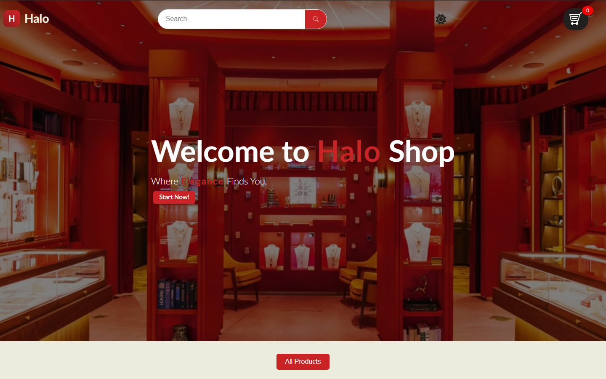

# Halo

A jewelry storefront I built in plain HTML, CSS, and JavaScript — no framework, just hand-rolled DOM manipulation.

**Live demo:** https://moham-amer.github.io/Halo-Expanded/



## What it does

- Product catalog fed from a REST API
- Debounced live search
- Product detail pages and modals
- Auto-sliding hero carousel
- Cart with a drawer, persisted in localStorage

## Run it locally

It's a static site — open `index.html` in a browser, or serve the folder:

```bash
npx serve .
```
